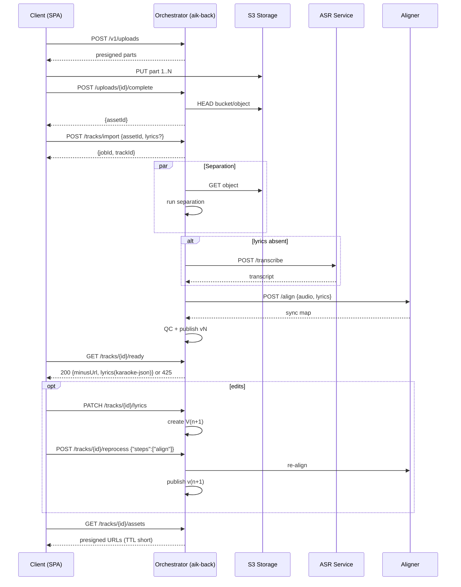
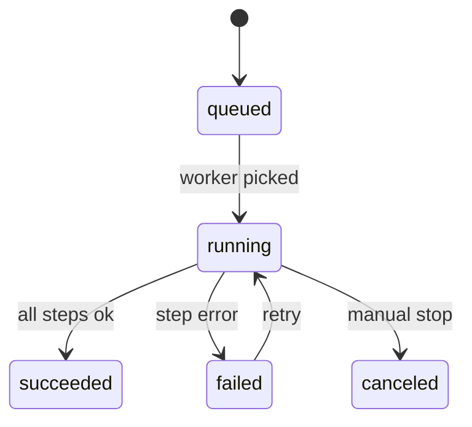

# AIK Media Pipeline Overview

This document captures the end-to-end media ingestion and processing workflow that powers the AIK backend. It aggregates the high-level flow, service interactions, job lifecycle, and integration contracts that external clients must follow.

## 1. Сквозной поток (Flowchart)

```mermaid
flowchart TD
    A[SPA/Client] -->|POST /v1/uploads| B[Init multipart]
    B --> C[S3 presigned parts]
    A -->|PUT parts to S3| D[Object parts]
    A -->|POST /v1/uploads/{id}/complete| E[assetId]
    A -->|POST /v1/tracks/import {assetId, lyrics?}| F[jobId, trackId]
    subgraph Pipeline
      F --> G[Separation]
      G --> H{Lyrics provided?}
      H -- yes --> I[Align-fast]
      H -- no --> J[ASR]
      J --> I
      I --> K[QC]
      K --> L[Publish vN]
    end
    L --> M{GET /v1/tracks/{id}/ready}
    M -- 425 Not Ready --> N[/Retry with backoff/]
    M -- 200 OK --> O[minusUrl + karaoke-json]
    O --> P{Need edits?}
    P -- yes --> Q[PATCH /lyrics -> V(n+1)]
    Q --> R[POST /tracks/{id}/reprocess align]
    R --> L
    P -- no --> S[GET /assets (minus/vocals/mix)]
```

## 2. Взаимодействия (Sequence)



## 3. Стейт-машина Job



## 4. Узлы интеграции и правила

- **Корреляция клиента:** каждый запрос клиента к API должен содержать `X-Client-Id`.
- **Пресайны:** URL для загрузки/выгрузки в S3 выдаются короткоживущими и привязаны к IP клиента.
- **Таймауты:** проверка доступности (health) для внешних зависимостей — до 1.5 секунды; каждый шаг пайплайна имеет собственные SLA.
- **Ошибки:** ответы об ошибках оформляются по RFC 7807 и включают `traceId`.
- **События наружу:** при импорте трека клиент передает `callbackUrl`; бэкенд посылает подписанные HMAC события `track.ready`, `job.failed`, `lyrics.updated`.

## 5. Дополнительные заметки

- Воронка публикации поддерживает множественные версии (vN) трека. Любые правки текста ведут к созданию новой версии и повторному шагу `align`.
- Получение ассетов доступно только после публикации и должно использовать пресайны с коротким TTL.

Эта схема служит основой для более детальной спецификации API и согласования интеграции между фронтендом и сервисами распознавания/синхронизации.
